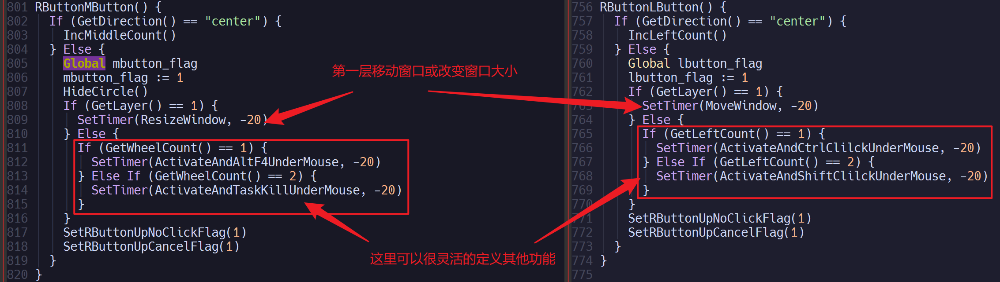
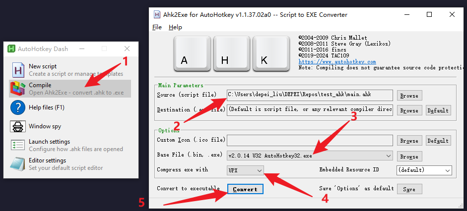
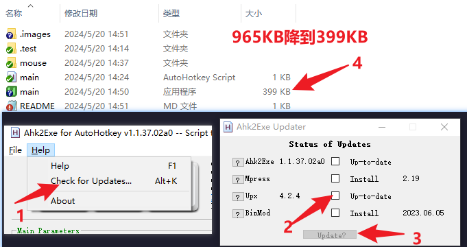

# 功能介绍

<!-- 240526-14h32m -->

1. 通过键盘按键实现,比如<Ctrl-Win-k>实现窗口的最大化和恢复,热键是`^#k`
2. 通过按下右键触发更多功能,可定制无限多的功能,可在例如`mouse\directions\1x1\right.ahk`里定义各种功能
> 1. 能制定无限种,并不是夸张,因为有几个不同的维度,在按下右键后
> > 1. 会出现提示`[1][1][1][0][0]: ...`
> > 2. 有5个维度
> > 3. 第一个维度可以通过在同心圆内按下中键改变
> > 4. 第二个维度可以通过在同心圆内按下左键改变
> > 5. 第三个维度可以通过在同心圆内向上或向下滚动滚轮改变
> > 6. 第四个维度可以通过移动鼠标改变,距离中心越远则越大
> > 7. 第五个维度可以通过移动鼠标改变,有8个方向,8个值
> > 8. 除了第5个维度,其他都能改变,在`mouse\config.ahk`定义了他们的值
> 2. 移动到不同的区域(不包括`center`),如果有定义功能,不会出现`[1][1][1][0][0]: ...`这种提示
> > 1. 而是出现`R: ...`,`U: ...`,`D: ...`,至少出现一个,至多出现3个
> > 2. 其中`R`代表松开右键,`U`代表向上滚动滚轮,`D`代表向下滚动滚轮
> > 3. 没有按下左键和中键,1是因为费劲,2是因为他们用作其他用途了
> 3. 按下右键后按下左键或中键的功能
> > 1. 已经实现的有移动窗口和改变窗口大小
> > 2. 具体见`RButtonLButton()`和`RButtonMButton()`
> > 3. 其中实现的移动窗口和改变窗口大小,只能在`center`外第一次处按下左键或中键实现,其他层可定义其他操作
> > > 1. 如下图所示实现了的功能

# 功能介绍(END)

c:\users\llydr\documents\autohotkey

ahk2exe

# 240521-00h56m

## [x] TODODONE: 全局鼠标

除了热键外,其他所有鼠标操作,都要经过按下鼠标右键

按下鼠标右键后,可以通过在不同的区域内,以以下三种方式,去做不同的事情

- `松开右键`
- `向上滚动滚轮`
- `向下滚动滚轮`

### [x] TODODONE:失效触发

按下鼠标右键后,以下事件会导致其他事件失效

- `滚动滚轮`,会让`松开右键`的事件失效
- `按下左键`或者`中键`,会让以上三种事件均失效

# 240521-01h06m

## [ ] TODO: 改变窗口位置和大小

触发后,右键已经松开

这时可以通过`左键`和`中键`去实现

完毕之后要退出,则可通过单击一次`右键`来完成

(240526-13h55m)

还是需要按住RButton才能做到,不然很麻烦,每次都需要先触发一次

### [ ] TODO: 增加功能

记录每次移动或大小的改变,以便撤销或者回复操作(可选)

# 240522-12h02m

目前的情况:

center LButton/WheelUp/Down -> wheel_count

- [x] TODODONE: 增加两个维度

center WheelUp/Down -> wheel_count
center LButton -> left_count
center MButton -> middle_count

# 240523-20h16m

- [x] TODODONE: move window和resize window需要限制在第一个元以外和第二元以内(包括),其他的不处理
- [x] TODODONE: 其他的用来Ctrl-RButton或者Ctrl-LButton

# 240524-12h49m

- [x] FIXDONE: 画圆之后,LButton & RButton,RButton Up,此时LButton/MButton会让内存占用从3.3M升到24M
- +Disable

# 240525-14h50m

- [x] TODODONE: 上电展示所有功能,最主要的是右键的功能
- 通过side_left实现
